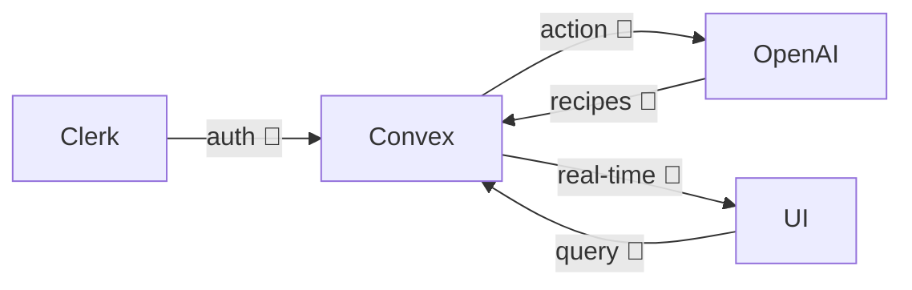

# NorfolkJS Presentation Implementation Plan

> **For agentic workers:** REQUIRED SUB-SKILL: Use superpowers:subagent-driven-development (recommended) or superpowers:executing-plans to implement this plan task-by-task. Steps use checkbox (`- [ ]`) syntax for tracking.

**Goal:** Ship a ~20-minute Slidev deck for NorfolkJS about Pantry Party (CodeTV 4-hour build) with a live multiplayer audience demo as the climax.

**Architecture:** Single-directory Slidev project in `/home/tekgadgt/work/pantry_party_presentation/`, markdown-based slides (`slides.md`), `seriph` theme, static-SPA build output to `dist/` for Netlify deploy. No custom Vue components unless a slide demonstrably needs one.

**Tech Stack:** Slidev (`@slidev/cli`), `@slidev/theme-seriph`, Vue (transitively), Mermaid (via Slidev), Shiki (via Slidev), Node 18+.

**Working directory:** `/home/tekgadgt/work/pantry_party_presentation/` (already a git repo with the spec committed on `main`).

**Verification approach:** Slidev has no real "test suite." We verify via `npm run build` after each slide batch — it parses the full deck, catches layout/syntax errors, resolves Vue/Mermaid blocks, and fails loudly on problems. Final task adds a PDF-export smoke test.

---

## File structure produced by this plan

```
pantry_party_presentation/
├── .gitignore                       # node_modules, dist, .DS_Store, etc.
├── README.md                        # speaker run/build/export + pre-talk checklist
├── package.json                     # Slidev deps + scripts
├── netlify.toml                     # deploy config (last task)
├── slides.md                        # the deck — all 20 slides
├── snippets/                        # created only if a code slide needs external snippets
├── public/
│   ├── photos/
│   │   ├── .gitkeep
│   │   └── placeholder-hero.svg    # placeholder so render doesn't 404
│   ├── video/
│   │   └── .gitkeep
│   └── screenshots/
│       └── .gitkeep
└── docs/superpowers/                # (already present — spec + this plan)
```

Each file has one clear responsibility. `slides.md` is the deck; `package.json` is the script surface; `public/` is assets; `README.md` is speaker docs; `netlify.toml` is deploy. No overlap.

---

## Task 1: Scaffold Slidev project

**Files:**
- Create: `package.json`
- Create: `slides.md` (minimal placeholder — one slide)

- [ ] **Step 1: Install Slidev + theme**

Run from `/home/tekgadgt/work/pantry_party_presentation/`:

```bash
npm init -y
npm install -D @slidev/cli @slidev/theme-seriph playwright-chromium
```

`playwright-chromium` is required by Slidev for `export` (PDF) to work. Pulling it now avoids a second npm run later.

Expected output: `package.json` created, `node_modules/` populated, no errors. If npm warns about a deprecated transitive dep, that's fine — don't fix what isn't broken.

- [ ] **Step 2: Add scripts to `package.json`**

Open `package.json`. Replace the `"scripts"` block with:

```json
"scripts": {
  "dev": "slidev --open",
  "build": "slidev build --base /",
  "export": "slidev export",
  "export-notes": "slidev export --with-clicks --with-toc"
}
```

Also set the top-level `"name"` to `"pantry-party-presentation"` and `"private": true` (prevents accidental publish). Leave `"version"` at `1.0.0`.

Final `package.json` should look roughly like:

```json
{
  "name": "pantry-party-presentation",
  "private": true,
  "version": "1.0.0",
  "scripts": {
    "dev": "slidev --open",
    "build": "slidev build --base /",
    "export": "slidev export",
    "export-notes": "slidev export --with-clicks --with-toc"
  },
  "devDependencies": {
    "@slidev/cli": "^0.51.0",
    "@slidev/theme-seriph": "^0.25.0",
    "playwright-chromium": "^1.47.0"
  }
}
```

(Dep version ranges will reflect whatever `npm install` pinned in Step 1 — don't rewrite them, only add the scripts and metadata.)

- [ ] **Step 3: Create minimal `slides.md`**

Create `slides.md` at the repo root with exactly:

```markdown
---
theme: seriph
title: Pantry Party — NorfolkJS
info: A 4-hour full-stack build and what changed in 5 months
class: text-center
---

# Pantry Party

Scaffolding check.
```

- [ ] **Step 4: Verify build**

Run:

```bash
npm run build
```

Expected output (tail): `✓ built in <N>ms` and a populated `dist/` directory containing `index.html`, `assets/`, etc.

If it fails with "Cannot find module @slidev/theme-seriph" or similar, re-run Step 1.

- [ ] **Step 5: Commit**

```bash
git add package.json package-lock.json slides.md
git commit -m "Scaffold Slidev project with seriph theme"
```

Do **not** add `node_modules/` — that gets ignored in Task 2.

---

## Task 2: `.gitignore` + asset directory structure

**Files:**
- Create: `.gitignore`
- Create: `public/photos/.gitkeep`
- Create: `public/video/.gitkeep`
- Create: `public/screenshots/.gitkeep`
- Create: `public/photos/placeholder-hero.svg`

- [ ] **Step 1: Write `.gitignore`**

Create `.gitignore` at repo root with:

```
node_modules
dist
.DS_Store
*.log
.vite
.slidev
```

- [ ] **Step 2: Create asset directories with placeholders**

```bash
mkdir -p public/photos public/video public/screenshots
touch public/photos/.gitkeep public/video/.gitkeep public/screenshots/.gitkeep
```

- [ ] **Step 3: Create a placeholder hero image**

Slides reference `/photos/bts-hero.jpg` and `/photos/app-hero.png` before speakers drop real assets in. Ship one simple SVG placeholder so rendering doesn't 404 during development. Create `public/photos/placeholder-hero.svg`:

```xml
<?xml version="1.0" encoding="UTF-8"?>
<svg xmlns="http://www.w3.org/2000/svg" viewBox="0 0 1600 900">
  <rect width="1600" height="900" fill="#1e293b"/>
  <text x="50%" y="50%" text-anchor="middle" dominant-baseline="middle"
        fill="#94a3b8" font-family="ui-sans-serif, system-ui" font-size="48">
    Replace with real asset
  </text>
</svg>
```

Later slides will reference `/photos/placeholder-hero.svg` until speakers swap in real images.

- [ ] **Step 4: Verify**

```bash
ls -R public/
```

Expected:
```
public/:
photos  screenshots  video
public/photos:
.gitkeep  placeholder-hero.svg
public/screenshots:
.gitkeep
public/video:
.gitkeep
```

- [ ] **Step 5: Commit**

```bash
git add .gitignore public/
git commit -m "Add .gitignore and asset directory skeleton"
```

---

## Task 3: Write the opening slides (1–6)

**Files:**
- Modify: `slides.md` (replace the single placeholder slide with slides 1–6)

- [ ] **Step 1: Write all six opening slides**

Replace the entire contents of `slides.md` with:

````markdown
---
theme: seriph
title: Pantry Party — NorfolkJS
info: A 4-hour full-stack build and what changed in 5 months
class: text-center
---

# Pantry Party

A 4-hour build, five months later

<div class="pt-12 opacity-75 text-xl">
  Ryan · Austin · NorfolkJS
</div>

<!--
Welcome. Intros. We'll walk you through a 4-hour full-stack build and what's changed in the tools since.
-->

---
layout: image
image: /photos/placeholder-hero.svg
class: text-white
---

# <span class="bg-black/60 px-4 py-2 rounded">4 hours. One demo. Whatever we could ship.</span>

<!--
CodeTV episode. 4 hours was all we had. Set the mindset before the mechanics.
-->

---
layout: center
---

# CodeTV's rules

- **30 minutes** to plan
- **4 hours** to build
- Ship something **shareable**

<div class="pt-8 text-sm opacity-60">Full-stack challenge episode</div>

<!--
Quick primer on the CodeTV format. Don't dwell — audience gets the shape.
-->

---
layout: two-cols
---

# Pantry Party

Collaborative rooms where people:

- 🥗 Pool pantry ingredients
- 🤖 Generate AI recipes
- 🗳️ Vote on favorites
- ⚡ See updates in real time

::right::


<!--
The concept in one paragraph. If a video clip is ready, swap image src to /video/<file>.mp4 with a <video> tag.
-->

---
layout: quote
---

# "Just use plain websockets."

_— us, that morning_

<v-click>

## "Have you tried Convex?"

_— Jason, 15 minutes in_

</v-click>

<v-click>

We adopted a real-time database neither of us had touched.

</v-click>

<!--
Biggest moment of hour one. The whole architecture swung on this suggestion.
-->

---
layout: center
---

# The stack

<div class="grid grid-cols-3 gap-8 pt-8 text-2xl">
  <div>Astro</div>
  <div>React</div>
  <div>Convex</div>
  <div>Clerk</div>
  <div>OpenAI</div>
  <div>Tailwind</div>
</div>

<!--
Name them fast. Hand off to Austin for the build segment.
-->
````

- [ ] **Step 2: Verify build**

```bash
npm run build
```

Expected: `✓ built in <N>ms`. If you see a warning about a missing image, it's fine — the placeholder-hero.svg should resolve; any other missing image suggests a typo in a path.

- [ ] **Step 3: Visual smoke check (optional but cheap)**

```bash
npm run dev &
sleep 3
curl -s http://localhost:3030/ | head -5
kill %1
```

Expected: HTML output starting with `<!DOCTYPE html>`. If `curl` fails, Slidev didn't start — check the dev console.

- [ ] **Step 4: Commit**

```bash
git add slides.md
git commit -m "Add opening slides (title, hook, format, concept, Convex pivot, stack)"
```

---

## Task 4: Write the build section (slides 7–12)

**Files:**
- Modify: `slides.md` (append slides 7–12)

- [ ] **Step 1: Append the Build section**

Append to `slides.md` (add after the stack slide from Task 3):

`````markdown

---
layout: center
class: bg-black text-white
---

<div class="opacity-60 text-sm">[ B-roll clip placeholder — swap with <video src="/video/codetv-broll.mp4" autoplay muted loop /> when clip is ready ]</div>

<!--
Let the clip play for ~15s. Sets room energy before we start talking shop.
-->

---
---

# What Copilot agent mode nailed

Each of these landed on the first try:

- Astro page + layout scaffolding
- Convex `schema.ts` — rooms, ingredients, recipes, votes
- Clerk setup — middleware, protected routes
- OpenAI recipe-generation action

<v-click>

<div class="pt-8 text-xl opacity-80">
Isolated pieces? Excellent.
</div>

</v-click>

<!--
Don't dunk on Copilot. The scaffolding work genuinely saved us hours.
-->

---
---

# Where it fell apart



The boxes worked. The **wiring** between them is where we bled hours.

<!--
The pivot slide of the build section. Emphasize: scaffolding good, integration hard.
-->

---
---

# Example: auth token didn't flow

Copilot scaffolded Clerk and Convex auth config separately. Wiring them together:

````md magic-move
```ts
// convex/auth.config.ts
export default {
  providers: [
    {
      domain: "clerk-jwt-issuer-hardcoded-here",
      applicationID: "convex",
    },
  ],
};
```

```ts
// convex/auth.config.ts
export default {
  providers: [
    {
      domain: process.env.CLERK_JWT_ISSUER_DOMAIN,
      applicationID: "convex",
    },
  ],
};
```
````

One env var. Twenty minutes of Googling.

<!--
Concrete, representative. Not the only integration bug, but the cleanest to show on stage.
-->

---
---

# The last 30 minutes

- Env vars not propagating to Netlify
- Convex prod deployment ≠ dev deployment
- Clerk JWT issuer URL mismatched between environments
- Recipe generation failing silently on prod

<v-click>

<div class="pt-6 text-xl">What fixed it: a lot of manual copying.</div>

</v-click>

<!--
War stories. Keep it tight and a little funny. Don't wallow.
-->

---
layout: center
class: bg-black text-white
---

<div class="opacity-60 text-sm">[ Final push clip placeholder — swap with <video src="/video/codetv-final-push.mp4" autoplay muted loop /> ]</div>

<!--
Ship-it energy. Transition out of the build segment and into "then vs. now."
-->
`````

- [ ] **Step 2: Verify build**

```bash
npm run build
```

Expected: `✓ built in <N>ms`. The Mermaid block will render during build — if it fails with a Mermaid parse error, check you didn't accidentally mangle the indentation.

- [ ] **Step 3: Commit**

```bash
git add slides.md
git commit -m "Add build section (copilot wins, integration gap, breakages, scramble)"
```

---

## Task 5: Write the tooling sidebar (slides 13–17)

**Files:**
- Modify: `slides.md` (append slides 13–17)

- [ ] **Step 1: Append the Tooling Sidebar section**

Append to `slides.md`:

`````markdown

---
layout: center
class: text-center
---

# Then → Now

<div class="text-sm opacity-60 mt-8">What changed in five months</div>

<!--
Beat pause. Pivot into the second half of the talk. Ryan takes over (soft lean).
-->

---
layout: two-cols
---

# Then

**Nov 2025**

GitHub Copilot agent mode

- Mix of Anthropic + OpenAI models under the hood
- Best tool available that day
- Great at generating files
- Struggled to cross systems

::right::

# Now

**Apr 2026**

Claude Code

- Daily driver
- Plans, specs, commits, reviews
- Same class of models, better harness

<!--
Don't overstate. Same models, different ergonomics. Set up the next slide.
-->

---
layout: center
---

# The gap that closed

<div class="text-6xl py-8 font-bold">integration</div>

The exact thing that cost us hours during the build  
is the thing that's most different now.

<!--
The thesis slide of the sidebar. Deliver it slowly. Pause after "integration."
-->

---
---

# Evidence: auth hardening

Three artifacts in the `pantry-party` repo, all produced in one session:

- **Spec** — `docs/superpowers/specs/2026-04-20-auth-hardening-design.md`
- **Plan** — `docs/superpowers/plans/2026-04-20-auth-hardening.md`
- **Commits** — `3abd7c5`, `5af3a3c`, `e6ac57f`, ... (small, narrated, reviewable)

````md magic-move
```ts
// src/middleware.ts — before
// (no middleware; /room routes unprotected)
```

```ts
// src/middleware.ts — after
import { clerkMiddleware, createRouteMatcher } from "@clerk/astro/server";

const isProtectedRoute = createRouteMatcher(["/room(.*)", "/create-room"]);

export const onRequest = clerkMiddleware((auth, context, next) => {
  if (isProtectedRoute(context.request) && !auth().userId) {
    return auth().redirectToSignIn();
  }
  return next();
});
```
````

One prompt. Cross-system wiring. PR-ready.

<!--
Point at the artifacts, don't read them. Magic-move makes the before/after obvious.
-->

---
---

# What still hurts / what works

**Still hard**

- Multi-service env var drift (same as before)
- Novel stacks with tiny training footprints
- UI polish judgment calls

**Surprisingly good**

- Following an explicit plan to the letter
- Refactors across 10+ files
- Catching its own mistakes on a re-read

**Day-to-day change**

- Prompt → diff is faster than scaffold → wire
- More time designing, less time plumbing

<!--
Balanced. Don't oversell. This calibrates the audience's trust for the rest of the talk.
-->
`````

- [ ] **Step 2: Verify build**

```bash
npm run build
```

Expected: `✓ built in <N>ms`. Magic-move blocks (double-fenced ```` ```md magic-move ````) are Slidev-specific — if build warns about an unknown code-block language, check the outer fence is exactly ```` ```md magic-move ```` with a leading `md`.

- [ ] **Step 3: Commit**

```bash
git add slides.md
git commit -m "Add tooling sidebar (then-vs-now, integration thesis, case study, honest take)"
```

---

## Task 6: Write the demo slides (18–19)

**Files:**
- Modify: `slides.md` (append slides 18–19)
- Create: `public/photos/qr-room-placeholder.png` (generated via shell)

- [ ] **Step 1: Generate a QR code placeholder**

Slide 18 needs a QR image at `/photos/qr-room.png`. Until speakers create the real demo room, stub one that points at the site root — this is overwritten before the talk.

```bash
# Check if qrencode is installed
which qrencode || echo "install qrencode (e.g., sudo apt install qrencode) before proceeding"

# Generate a placeholder QR pointing to pantryparty.lol (swap to /room/<code> before the talk)
qrencode -o public/photos/qr-room.png -s 10 'https://pantryparty.lol/'
```

If `qrencode` isn't available: create an empty `public/photos/qr-room.png` with `touch`, and document in the README (Task 9) that speakers must generate the real QR before presenting. The slide will render with a broken-image icon until it's real — acceptable for draft.

- [ ] **Step 2: Append the Demo section**

Append to `slides.md`:

````markdown

---
layout: center
---

# Try it yourself

<div class="grid grid-cols-2 gap-12 items-center pt-4">
  <div>
    
    <div class="text-center pt-4 text-xl font-mono">
      pantryparty.lol/room/XXXX
    </div>
    <div class="text-center pt-2 text-sm opacity-60">
      Sign up (username / password), join the room, add ingredients.
    </div>
  </div>
  <iframe
    src="https://pantryparty.lol/"
    class="w-full h-96 rounded-lg border border-gray-300"
    sandbox="allow-scripts allow-forms allow-same-origin allow-popups"
  />
</div>

<!--
Read the URL out loud. Give the audience ~30s to scan. Then start driving: add pre-seed ingredients, trigger recipes, vote live. The iframe reflects the live site so they can see real-time updates even before they've signed up.
-->

---
hide: true
---

# Demo backup

<video src="/video/demo-backup.mp4" controls class="w-full max-w-4xl mx-auto" />

<!--
Hidden from normal flow. If the live demo fails, press `o` to open the slide overview, arrow to this slide. 30-second pre-recorded end-to-end run.
-->
````

- [ ] **Step 3: Verify build**

```bash
npm run build
```

Expected: `✓ built in <N>ms`. If the build warns about `/video/demo-backup.mp4` being missing, that's fine — Slidev references assets by URL at render, not build time. The slide will show a broken video until speakers record the backup.

- [ ] **Step 4: Commit**

```bash
git add slides.md public/photos/qr-room.png
git commit -m "Add demo slides (try-it-yourself with QR + iframe, hidden backup)"
```

---

## Task 7: Write the wrap slide (20)

**Files:**
- Modify: `slides.md` (append slide 20)

- [ ] **Step 1: Append the Wrap section**

Append to `slides.md`:

````markdown

---
layout: center
---

# Thanks

<div class="pt-4 text-lg">

**Pantry Party** — [pantryparty.lol](https://pantryparty.lol)
**Source** — github.com/austingalyon/pantry-party
**This deck** — [deck URL — fill in post-deploy]

</div>

<div class="pt-12 text-sm opacity-60">
  Ryan · Austin · NorfolkJS 2026
</div>

<div class="pt-8 text-3xl">Questions?</div>

<!--
Thanks + Q&A. Leave the QR from slide 18 on screen if audience is still signing up.
-->
````

Note: the "This deck" URL placeholder stays until Netlify deploys, then speakers update it by hand. That's the one intentional hole in the content.

- [ ] **Step 2: Verify build**

```bash
npm run build
```

Expected: `✓ built in <N>ms`.

- [ ] **Step 3: Commit**

```bash
git add slides.md
git commit -m "Add wrap slide (thanks, links, Q&A)"
```

---

## Task 8: Speaker notes consistency pass

**Files:**
- Modify: `slides.md` (verify every slide has a `<!-- ... -->` notes block)

Every slide from Tasks 3–7 already has a `<!-- ... -->` notes block. This task is a consistency verification pass, not new content.

- [ ] **Step 1: Audit notes coverage**

Run:

```bash
grep -c '^<!--' slides.md
```

Expected: `20` (one note block per slide). If the count is lower, use:

```bash
awk '/^---$/ {s++; seen[s]=0} /^<!--/ {seen[s]=1} END {for (i in seen) if (!seen[i]) print "slide " i " missing note"}' slides.md
```

Add a `<!-- ... -->` block to any slide missing one. Keep each note ≤ 3 lines.

- [ ] **Step 2: Verify notes render in presenter mode**

Start dev server and check presenter view:

```bash
npm run dev &
sleep 3
curl -s http://localhost:3030/presenter/ | grep -c 'presenter' || echo "presenter view did not load"
kill %1
```

Expected: at least one match for `presenter`. (Visual verification happens during rehearsal — this is just a "page responds" check.)

- [ ] **Step 3: Commit (only if notes were added in Step 1)**

```bash
git add slides.md
git commit -m "Ensure every slide has speaker notes"
```

If no notes were added, skip the commit — Step 1 was just an audit.

---

## Task 9: Speaker README

**Files:**
- Create: `README.md`

- [ ] **Step 1: Write the README**

Create `README.md` at repo root with:

```markdown
# Pantry Party — NorfolkJS Presentation

Slidev deck for the NorfolkJS talk about Pantry Party (the 4-hour CodeTV build).

## Quick start

```bash
npm install
npm run dev
```

Opens at `http://localhost:3030/`. Press `p` for presenter view, `o` for slide overview.

## Build + export

```bash
npm run build          # static SPA → dist/
npm run export         # PDF of the full deck → slides-export.pdf
npm run export-notes   # PDF with clicks + TOC (speaker-notes companion)
```

## Pre-talk checklist (the day of)

- [ ] Create a fresh demo room on `pantryparty.lol` and copy the room code
- [ ] Pre-seed the room with 5–8 ingredients (e.g., eggs, flour, tomatoes, basil, garlic, olive oil, parmesan, pasta)
- [ ] Set reasonable dietary constraints (e.g., none / vegetarian-friendly)
- [ ] Regenerate the QR pointing at the real room URL:

  ```bash
  qrencode -o public/photos/qr-room.png -s 10 'https://pantryparty.lol/room/<ROOM_CODE>'
  ```

- [ ] Update the printed URL on slide #18 (`slides.md`, search for `room/XXXX`) to the real room code
- [ ] Update the "This deck" URL on slide #20 to the deployed Netlify URL
- [ ] Record a 30-second backup clip and drop at `public/video/demo-backup.mp4`
- [ ] Swap video placeholders on slides #7 and #12 to the real B-roll clips
- [ ] Run the deck end-to-end once (`npm run dev`, press `r` at slide 1 to time)
- [ ] Concurrency dry-run: 10+ browsers/devices join the demo room; watch connected-users display and recipe-generation time

## Slide structure (20 slides, ~20 min)

1–6: Opening (~4 min)
7–12: The Build (~5 min)
13–17: Then vs. Now tooling sidebar (~4 min)
18–19: Live demo + hidden backup (~6–8 min)
20: Wrap / Q&A (~1 min)

## Deploy

Netlify, building from `main`:

```bash
npm run build
# commits automatically pick up via netlify.toml
```

Manual setup: connect the repo in Netlify UI, point build command at `npm run build`, publish directory at `dist`.

## Editing

Two speakers, direct pushes to `main`. `slides.md` diffs cleanly in git.

Theme swap: change `theme: seriph` in the top frontmatter of `slides.md` to any installed theme (e.g., `theme: default`, `theme: apple-basic`). Re-install the theme package first if not already in `devDependencies`.

## Spec + plan

- Spec: `docs/superpowers/specs/2026-04-20-norfolkjs-presentation-design.md`
- Plan: `docs/superpowers/plans/2026-04-20-norfolkjs-presentation.md`
```

- [ ] **Step 2: Commit**

```bash
git add README.md
git commit -m "Add speaker README with pre-talk checklist"
```

---

## Task 10: Production build + PDF export smoke test

**Files:** (no changes; this task is a verification checkpoint)

- [ ] **Step 1: Clean build**

```bash
rm -rf dist/
npm run build
```

Expected: `✓ built in <N>ms`. A populated `dist/index.html` and `dist/assets/`.

- [ ] **Step 2: Inspect build output**

```bash
ls dist/
```

Expected: `index.html`, `assets/`, and at minimum a JS and CSS bundle. If `dist/` is empty or missing `index.html`, the build silently failed — check console for errors.

- [ ] **Step 3: Export to PDF**

```bash
npm run export
```

Expected: a file `slides-export.pdf` at the repo root, roughly 20 pages, each page corresponding to a slide. First run downloads Chromium via playwright (~100 MB); subsequent runs are fast.

If export fails with "Executable doesn't exist" or similar, run `npx playwright install chromium` and retry.

- [ ] **Step 4: Verify PDF page count**

```bash
# Best-effort page count via common tools; any of these works.
command -v pdfinfo >/dev/null && pdfinfo slides-export.pdf | grep Pages
command -v qpdf >/dev/null && qpdf --show-npages slides-export.pdf
# Or just: ls -lh slides-export.pdf  (a ~20-slide deck is typically 500 KB – 3 MB)
```

Expected: 20 pages (± 1 — Slidev sometimes splits v-click animations across pages).

- [ ] **Step 5: Ignore build artifacts**

Confirm `dist/`, `slides-export.pdf`, and `node_modules/` are all gitignored:

```bash
git status
```

Expected: nothing staged, nothing untracked except files that belong (which should be none at this point). If `slides-export.pdf` shows as untracked, append `*.pdf` to `.gitignore`:

```bash
echo '*.pdf' >> .gitignore
git add .gitignore
git commit -m "Gitignore PDF exports"
```

Skip the commit if the PDF was already ignored by one of the existing patterns.

---

## Task 11: Netlify deploy config

**Files:**
- Create: `netlify.toml`

- [ ] **Step 1: Write `netlify.toml`**

Create `netlify.toml` at repo root:

```toml
[build]
  command = "npm run build"
  publish = "dist"

[build.environment]
  NODE_VERSION = "20"

[[redirects]]
  from = "/*"
  to = "/index.html"
  status = 200
```

The redirect rule lets Slidev's client-side routing work on Netlify — without it, deep links like `pantry-party-presentation.netlify.app/5` 404.

- [ ] **Step 2: Verify the build command still works**

```bash
rm -rf dist/
npm run build
```

Expected: `✓ built in <N>ms`. `netlify.toml` is declarative, not executable — this step just confirms nothing regressed.

- [ ] **Step 3: Commit**

```bash
git add netlify.toml
git commit -m "Add Netlify deploy config"
```

- [ ] **Step 4: Document the manual hookup**

Netlify deploy requires one-time UI setup (connecting the GitHub repo, picking a site name). That's out of scope for code — the README already documents the mental model. Print this reminder when the task completes:

> **Manual step (not automated):** Push this repo to GitHub, then at app.netlify.com → "Add new site" → "Import an existing project" → select the repo. Netlify reads `netlify.toml` automatically and will deploy on every push to `main`.

---

## Self-Review (ran by plan author)

**Spec coverage:**
- ✅ Slidev scaffold (Task 1)
- ✅ Directory structure per spec (Task 2)
- ✅ All 20 slides with structured flow (Tasks 3–7)
- ✅ Speaker notes per slide (Tasks 3–7 + Task 8 audit)
- ✅ Audience demo slide with QR + iframe (Task 6)
- ✅ Hidden backup clip slide (Task 6)
- ✅ Pre-seed / pre-talk logistics documented (Task 9 README)
- ✅ Concurrency dry-run in README checklist (Task 9)
- ✅ Build + PDF export verified (Task 10)
- ✅ Netlify deploy config (Task 11)

**Placeholder scan:**
- "This deck" URL on slide #20 is an intentional, documented hole (filled post-deploy).
- `public/video/demo-backup.mp4` is an intentional, documented asset hole (speakers record).
- Video placeholder text on slides #7 and #12 (`[ B-roll clip placeholder — swap with ... ]`) — documented in README; stays visible until speakers swap. Acceptable since they're user-facing instructions, not TBDs.
- No other placeholders or TODOs.

**Type consistency:**
- Asset paths consistent (`/photos/qr-room.png`, `/video/demo-backup.mp4`, `/photos/placeholder-hero.svg`)
- Script names consistent (`dev`, `build`, `export`, `export-notes`)
- Theme name consistent (`seriph`)

**Scope:** Single implementation plan, single deliverable (the deck). No decomposition needed.
