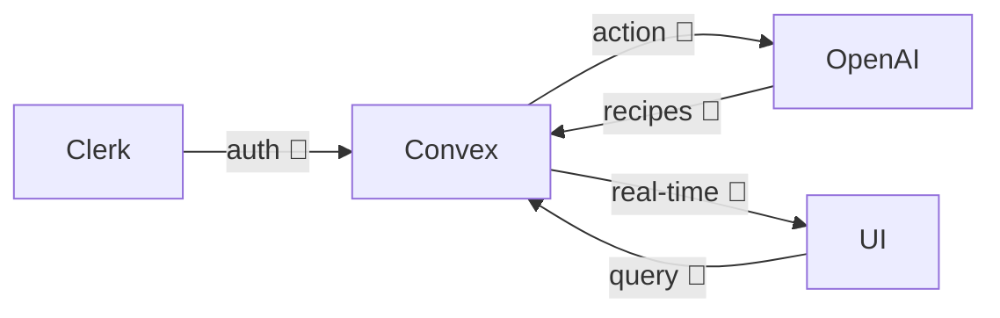

# NorfolkJS Deck Restructure Implementation Plan

> **For agentic workers:** REQUIRED SUB-SKILL: Use superpowers:subagent-driven-development (recommended) or superpowers:executing-plans to implement this plan task-by-task. Steps use checkbox (`- [ ]`) syntax for tracking.

**Goal:** Take the deck from its current state (~20 in-flow + 1 hidden, Then→Now-framed) to the restructured state defined in `docs/superpowers/specs/2026-04-27-deck-restructure-design.md` — 15 in-flow + 1 hidden, with three concrete post-episode feature shipments as the substance.

**Architecture:** All content edits live in `slides.md` (one file, slides separated by `---`). Each slide is structurally independent. Edits anchor on slide H1 headings (or other unique strings) rather than line numbers, so order of operations is forgiving. After every task, commit. Visual verification happens in `npm run dev` — no test framework applies to a slide deck. The README slide-structure section is updated as the final substantive task.

**Tech Stack:** Slidev (`@slidev/cli` + `@slidev/theme-seriph`), Markdown, Vue (`qrcode.vue` for the demo slide), Tailwind utilities (already provided by Slidev). Node 18+. Browser for visual verification.

---

### Task 1: Pre-flight — boot dev server and confirm baseline

**Files:**
- Read: `slides.md` (no edits)

- [ ] **Step 1: Start the Slidev dev server in the background**

```bash
npm run dev -- --port 3030
```

The `--open` flag in `package.json`'s `dev` script normally launches a browser. If running headless, drop the flag and open manually.

- [ ] **Step 2: Confirm rendering**

Open `http://localhost:3030` in a browser (or your IDE preview). Navigate to slides 1, 12 ("Final push clip" — the second B-roll), and 21 (hidden backup, accessible via `o` overview).
Expected: all three render. Slide 1 is "Pantry Party" with the speaker line. Slide 12 shows a placeholder text block. Slide 21 has a `<video>` tag pointing at the demo-backup stub.

- [ ] **Step 3: Note any pre-existing rendering issues**

If anything is broken on baseline (red Vite errors in the terminal, blank slides), stop and fix before proceeding. The restructure assumes a clean starting deck.

(No commit on this task — pre-flight only.)

---

### Task 2: Rewrite the deck frontmatter and Title slide

**Files:**
- Modify: `slides.md` (top of file, the deck frontmatter + first slide body)

The current title is "Pantry Party" with subhead "A 4-hour build, five months later". The new title leans into the meetup hook ("670K people watched us vibe code"). The deck-level `info:` field also updates.

- [ ] **Step 1: Replace the deck frontmatter and slide 1 body**

In `slides.md`, find this block (the very first 19 lines):

```markdown
---
theme: seriph
title: Pantry Party — NorfolkJS
info: A 4-hour full-stack build and what changed in 5 months
class: text-center
---

# Pantry Party

A 4-hour build, five months later

<div class="pt-12 opacity-75 text-xl">
  Ryan · Austin · NorfolkJS
</div>

<!--
Welcome. Intros. We'll walk you through a 4-hour full-stack build and what's changed in the tools since.
-->
```

Replace with:

```markdown
---
theme: seriph
title: Pantry Party — NorfolkJS
info: 670K people watched us vibe code (and what we did about it)
class: text-center
---

# 670K people watched us vibe code

<div class="pt-6 text-2xl opacity-90">
  Pantry Party · 4 hours · CodeTV
</div>

<div class="pt-12 opacity-75 text-xl">
  Ryan · Austin · NorfolkJS
</div>

<!--
Hook. Reference the meetup title and the episode. Pivot fast — build recap is short, the post-episode work is the substance. If a CodeTV thumbnail screenshot becomes available, swap to a `layout: image` with the screenshot as backdrop.
-->
```

- [ ] **Step 2: Verify in browser**

Reload slide 1.
Expected: new heading "670K people watched us vibe code" with two subheadings ("Pantry Party · 4 hours · CodeTV" and "Ryan · Austin · NorfolkJS").

- [ ] **Step 3: Commit**

```bash
git add slides.md
git commit -m "Rewrite title slide to lean into the 670K meetup hook"
```

---

### Task 3: Delete the secondary-hook slide ("4 hours. One demo. Whatever we could ship.")

**Files:**
- Modify: `slides.md`

The current slide 2 is a placeholder hero-image slide whose function (set the 4-hour mindset) is now folded into the rewritten title slide.

- [ ] **Step 1: Remove the slide block**

Find and delete this exact block (it sits immediately after the title slide):

```markdown
---
layout: image
image: /photos/placeholder-hero.svg
class: text-white
---

# <span class="bg-black/60 px-4 py-2 rounded">4 hours. One demo. Whatever we could ship.</span>

<!--
CodeTV episode. 4 hours was all we had. Set the mindset before the mechanics.
-->

```

(Include the trailing blank line — Slidev needs a clean separator between slides.)

- [ ] **Step 2: Verify in browser**

Reload. Slide 2 should now be "CodeTV's rules" (the format slide).
Expected: slide count drops by 1; format slide is in slot 2.

- [ ] **Step 3: Commit**

```bash
git add slides.md
git commit -m "Remove secondary hook slide; title slide now owns the 4-hour hook"
```

---

### Task 4: Reword the concept slide → "What we shipped on camera"

**Files:**
- Modify: `slides.md`

The current "Pantry Party" concept slide stays structurally (two-cols, bullets, image) but the heading and intro shift to past tense — "what shipped on the episode" — to set up the "we kept building" pivot later.

- [ ] **Step 1: Update the slide**

Find this block:

```markdown
---
layout: two-cols
---

# Pantry Party

Collaborative rooms where people:

- 🥗 Pool pantry ingredients
- 🤖 Generate AI recipes
- 🗳️ Vote on favorites
- ⚡ See updates in real time

::right::


<!--
The concept in one paragraph. If a video clip is ready, swap image src to /video/<file>.mp4 with a <video> tag.
-->
```

Replace with:

```markdown
---
layout: two-cols
---

# What we shipped on camera

Pantry Party — collaborative rooms where people:

- 🥗 Pool pantry ingredients
- 🤖 Generate AI recipes
- 🗳️ Vote on favorites
- ⚡ See updates in real time

::right::


<!--
Past tense — this is what shipped on the episode. Audience may already know it from the show. If a video clip is ready, swap image src to /video/<file>.mp4 with a <video> tag.
-->
```

- [ ] **Step 2: Verify in browser**

Reload. The concept slide now reads "What we shipped on camera" with "Pantry Party — collaborative rooms..." as the lede.

- [ ] **Step 3: Commit**

```bash
git add slides.md
git commit -m "Reframe concept slide as 'What we shipped on camera'"
```

---

### Task 5: Delete the stack roll-call slide

**Files:**
- Modify: `slides.md`

Per spec Open Question #2, default is to cut the stack grid. Stack components (Convex, Clerk, etc.) surface organically through the workflow + feature slides.

- [ ] **Step 1: Remove the slide block**

Find and delete this exact block:

```markdown
---
layout: center
---

# The stack

<div class="grid grid-cols-3 gap-8 pt-8 text-2xl">
  <div>Astro</div>
  <div>React</div>
  <div>Convex</div>
  <div>Clerk</div>
  <div>OpenAI</div>
  <div>Tailwind</div>
</div>

<!--
Name them fast. Hand off to Austin for the build segment.
-->

```

- [ ] **Step 2: Verify in browser**

Reload. The flow now goes: Convex pivot → B-roll placeholder.

- [ ] **Step 3: Commit**

```bash
git add slides.md
git commit -m "Remove stack roll-call slide; stack surfaces organically later"
```

---

### Task 6: Rewrite the first B-roll slide → "What 4 hours actually looks like"

**Files:**
- Modify: `slides.md`

This slide compresses the build-recap chaos into a single beat. The war stories that currently live in the "Last 30 minutes" slide get folded into the subhead here. Brand attribution drops (no "Copilot specifically").

- [ ] **Step 1: Replace the B-roll placeholder slide**

Find this block (the *first* B-roll slide — the one before "What Copilot agent mode nailed"):

```markdown
---
layout: center
class: bg-black text-white
---

<div class="opacity-60 text-sm">[ B-roll clip placeholder — swap with &lt;video src="/video/codetv-broll.mp4" autoplay muted loop /&gt; when clip is ready ]</div>

<!--
Let the clip play for ~15s. Sets room energy before we start talking shop.
-->
```

Replace with:

```markdown
---
layout: center
class: bg-black text-white
---

# What 4 hours actually looks like

<div class="pt-8 text-2xl">
  <div>First 3 hours: scaffolding worked.</div>
  <v-click>
    <div class="pt-6">Last 30 minutes: everything was on fire.</div>
  </v-click>
</div>

<v-click>

<div class="pt-8 text-base opacity-70 max-w-2xl mx-auto text-left">
  Env vars not propagating · Convex prod ≠ dev · Clerk JWT mismatch · recipes failing silently · a lot of manual copying
</div>

</v-click>

<!--
Compress the build chaos into two beats. AI scaffolding got the boxes; integration is where 4-hour builds bleed. If a CodeTV B-roll clip becomes available, swap the layout for a `<video>` tag and let the chaos play under the text.
-->
```

- [ ] **Step 2: Verify in browser**

Reload. The slide should show "What 4 hours actually looks like" on a black background, with the second line and the war-story bullets revealed by clicks.

- [ ] **Step 3: Commit**

```bash
git add slides.md
git commit -m "Rewrite first B-roll slide as the chaotic-energy compression"
```

---

### Task 7: Delete the current build-recap middle (5 slides)

**Files:**
- Modify: `slides.md`

Five slides go in this commit, all in a contiguous block: "What Copilot agent mode nailed", "Where it fell apart" (mermaid), "Example: auth token didn't flow" (magic-move), "The last 30 minutes", "Final push clip" (second B-roll). The chaotic-energy slide from Task 6 absorbs their function.

- [ ] **Step 1: Delete "What Copilot agent mode nailed"**

Find and delete this block:

```markdown
---
---

# What Copilot agent mode nailed

Each of these landed on the first try:

- Astro page + layout scaffolding
- Convex `schema.ts` — rooms, ingredients, recipes, votes
- Clerk setup — middleware, protected routes
- OpenAI recipe-generation action

<v-click>

<div class="pt-8 text-xl opacity-80">
Isolated pieces? Excellent.
</div>

</v-click>

<!--
Don't dunk on Copilot. The scaffolding work genuinely saved us hours.
-->

```

- [ ] **Step 2: Delete "Where it fell apart" (mermaid)**

Find and delete this block:

````markdown
---
---

# Where it fell apart



The boxes worked. The **wiring** between them is where we bled hours.

<!--
The pivot slide of the build section. Emphasize: scaffolding good, integration hard.
-->

````

- [ ] **Step 3: Delete "Example: auth token didn't flow" (magic-move)**

Find and delete this block:

`````markdown
---
---

# Example: auth token didn't flow

Copilot scaffolded Clerk and Convex auth config separately. Wiring them together:

````md magic-move
```ts
// convex/auth.config.ts
export default {
  providers: [
    {
      domain: "clerk-jwt-issuer-hardcoded-here",
      applicationID: "convex",
    },
  ],
};
```

```ts
// convex/auth.config.ts
export default {
  providers: [
    {
      domain: process.env.CLERK_JWT_ISSUER_DOMAIN,
      applicationID: "convex",
    },
  ],
};
```
````

One env var. Twenty minutes of Googling.

<!--
Concrete, representative. Not the only integration bug, but the cleanest to show on stage.
-->

`````

- [ ] **Step 4: Delete "The last 30 minutes"**

Find and delete this block:

```markdown
---
---

# The last 30 minutes

- Env vars not propagating to Netlify
- Convex prod deployment ≠ dev deployment
- Clerk JWT issuer URL mismatched between environments
- Recipe generation failing silently on prod

<v-click>

<div class="pt-6 text-xl">What fixed it: a lot of manual copying.</div>

</v-click>

<!--
War stories. Keep it tight and a little funny. Don't wallow.
-->

```

- [ ] **Step 5: Delete "Final push clip" (second B-roll)**

Find and delete this block:

```markdown
---
layout: center
class: bg-black text-white
---

<div class="opacity-60 text-sm">[ Final push clip placeholder — swap with &lt;video src="/video/codetv-final-push.mp4" autoplay muted loop /&gt; ]</div>

<!--
Ship-it energy. Transition out of the build segment and into "then vs. now."
-->

```

- [ ] **Step 6: Verify in browser**

Reload. The flow now goes: chaotic-energy slide → "Then → Now" transition. Five slides removed in this commit.
Expected: slide count drops from 19 to 14 in the visible flow.

- [ ] **Step 7: Commit**

```bash
git add slides.md
git commit -m "Drop deprecated build-recap middle (Copilot wins, mermaid, auth-token magic-move, last-30, final-push B-roll)"
```

---

### Task 8: Insert new slide — "We shipped. Barely."

**Files:**
- Modify: `slides.md`

The pivot slide of the talk: honest framing of MVP at end-of-episode, before transitioning into post-episode work.

- [ ] **Step 1: Insert the new slide after the chaotic-energy slide**

Find the chaotic-energy slide (heading: `# What 4 hours actually looks like`). Immediately after its closing speaker-note `<!-- ... -->` and the trailing blank line, before the next slide's `---` separator, insert:

```markdown
---
layout: center
---

# We shipped. Barely.

<div class="pt-6 text-lg opacity-80 max-w-2xl mx-auto text-left">
At the end of 4 hours we had:
</div>

<div class="pt-4 text-lg max-w-2xl mx-auto text-left">

- Backend auth checks commented out (`tempUserId` hack in `addIngredient`)
- Clerk JWT issuer hardcoded
- `ConvexClientProvider` duplicated across 4 files
- Env vars manually copied around

</div>

<v-click>

<div class="pt-10 text-2xl text-center">The episode ended here. The talk doesn't.</div>

</v-click>

<!--
Honest framing. The MVP shipped, but it shipped rough. This is the pivot — episode ends here, talk doesn't.
-->

```

- [ ] **Step 2: Verify in browser**

Reload. The new slide should appear after the chaotic-energy slide and before whatever currently follows (likely "Then → Now" — that gets removed in the next task).
Expected: heading "We shipped. Barely." with a list of MVP rough edges and a click-revealed pivot line.

- [ ] **Step 3: Commit**

```bash
git add slides.md
git commit -m "Add 'We shipped. Barely.' pivot slide"
```

---

### Task 9: Delete current Then→Now sidebar transitions (3 slides)

**Files:**
- Modify: `slides.md`

Three transition / framing slides go in this commit: "Then → Now" beat-pause, "Then" / "Now" two-column, and "The gap that closed: integration" thesis. The new "Five months later" + workflow slides replace them.

- [ ] **Step 1: Delete "Then → Now" transition**

Find and delete this block:

```markdown
---
layout: center
class: text-center
---

# Then → Now

<div class="text-sm opacity-60 mt-8">What changed in five months</div>

<!--
Beat pause. Pivot into the second half of the talk. Ryan takes over (soft lean).
-->

```

- [ ] **Step 2: Delete "Then" / "Now" two-column**

Find and delete this block:

```markdown
---
layout: two-cols
---

# Then

**Nov 2025**

GitHub Copilot agent mode

- Mix of Anthropic + OpenAI models under the hood
- Best tool available that day
- Great at generating files
- Struggled to cross systems

::right::

# Now

**Apr 2026**

Claude Code

- Daily driver
- Plans, specs, commits, reviews
- Same class of models, better harness

<!--
Don't overstate. Same models, different ergonomics. Set up the next slide.
-->

```

- [ ] **Step 3: Delete "The gap that closed: integration"**

Find and delete this block:

```markdown
---
layout: center
---

# The gap that closed

<div class="text-6xl py-8 font-bold">integration</div>

The exact thing that cost us hours during the build  
is the thing that's most different now.

<!--
The thesis slide of the sidebar. Deliver it slowly. Pause after "integration."
-->

```

- [ ] **Step 4: Verify in browser**

Reload. The flow now goes: "We shipped. Barely." → directly to the existing "Evidence: auth hardening" slide (which gets reframed in Task 13).

- [ ] **Step 5: Commit**

```bash
git add slides.md
git commit -m "Drop Then→Now sidebar transitions; brand-comparison framing dropped per D4"
```

---

### Task 10: Insert "Five months later" transition slide

**Files:**
- Modify: `slides.md`

Single transition slide. Sets up that the rest of the talk is post-episode work the audience hasn't seen.

- [ ] **Step 1: Insert after the "We shipped. Barely." slide**

Find the "We shipped. Barely." slide (heading: `# We shipped. Barely.`). After its closing speaker-note `<!-- ... -->` and trailing blank line, insert:

```markdown
---
layout: center
class: text-center
---

# Five months later

<div class="text-xl opacity-60 mt-8">We kept building.</div>

<!--
Beat pause. Pivot into post-episode work. The audience hasn't seen any of the rest yet. (Phrasing alternative per spec Open Question #4: "A week ago" — more arresting but loses the Nov-2025 → Apr-2026 framing the audience expects from the episode reference.)
-->

```

- [ ] **Step 2: Verify in browser**

Reload.
Expected: a centered "Five months later" heading with "We kept building." subhead.

- [ ] **Step 3: Commit**

```bash
git add slides.md
git commit -m "Add 'Five months later' transition slide"
```

---

### Task 11: Insert "The workflow" slide

**Files:**
- Modify: `slides.md`

Show the actual `docs/superpowers/` directory structure that exists on `pantry-party`'s `upstream/main`. Brief description of the spec → plan → commits loop. Don't oversell.

- [ ] **Step 1: Insert after "Five months later"**

After the "Five months later" slide's closing speaker-note and trailing blank line, insert:

````markdown
---
---

# The workflow

Spec → Plan → Commits.

```text
docs/superpowers/specs/
  2026-04-20-auth-hardening-design.md
  2026-04-20-ai-provider-toggle-design.md
  2026-04-20-user-dietary-profiles-design.md
docs/superpowers/plans/
  2026-04-20-auth-hardening.md
  2026-04-20-ai-provider-toggle.md
  2026-04-20-user-dietary-profiles.md
```

<div class="pt-4 text-base opacity-70">
Each feature: a written spec, a step-by-step plan, then small narrated commits.
</div>

<!--
Describe the loop, don't oversell. The artifacts are real and on disk in the pantry-party repo. Shiki will syntax-color the directory tree as a `text` block — fine.
-->

````

- [ ] **Step 2: Verify in browser**

Reload.
Expected: "The workflow" heading with a code-block file tree showing the six markdown files, plus a one-line caption beneath.

- [ ] **Step 3: Commit**

```bash
git add slides.md
git commit -m "Add 'The workflow' slide showing pantry-party docs/superpowers/ tree"
```

---

### Task 12: Insert "Three features in a week" overview slide

**Files:**
- Modify: `slides.md`

Three-column overview with feature names, artifact callouts, and one-line summaries. Commit counts approximate — sourced from `git log upstream/main` on `pantry-party` (auth ~14 work commits, provider toggle ~16, dietary profiles ~9 + 1 docs commit; spec/plan commits not counted in those numbers).

- [ ] **Step 1: Insert after "The workflow"**

After "The workflow" slide's closing speaker-note and trailing blank line, insert:

```markdown
---
---

# Three features in a week

<div class="grid grid-cols-3 gap-6 pt-8 text-base">

<div>

### Auth hardening
<div class="opacity-60 text-sm pt-1">spec · plan · ~14 commits</div>
<div class="pt-3 opacity-90">Proper auth, env-driven config, deduplicated provider wrapper.</div>

</div>

<div>

### AI provider toggle
<div class="opacity-60 text-sm pt-1">spec · plan · ~16 commits</div>
<div class="pt-3 opacity-90">Claude + OpenAI, switchable per room, provider badge on cards.</div>

</div>

<div>

### Dietary profiles
<div class="opacity-60 text-sm pt-1">spec · plan · ~9 commits + 1 docs</div>
<div class="pt-3 opacity-90">Persistent user preferences, merged into recipe prompts.</div>

</div>

</div>

<div class="pt-10 text-sm opacity-60 text-center">All on 2026-04-20.</div>

<!--
Three feature ships in a week. Pattern, not anecdote. The "all on 2026-04-20" line is true and a little funny — the work was concentrated. (Verify exact commit counts pre-talk from `git log upstream/main` on the pantry-party repo.)
-->

```

- [ ] **Step 2: Verify in browser**

Reload.
Expected: three columns side-by-side, each with feature name, artifact line in muted color, and one-line summary.

- [ ] **Step 3: Commit**

```bash
git add slides.md
git commit -m "Add 'Three features in a week' overview slide"
```

---

### Task 13: Reframe auth-hardening slide as two-beat (spec'd middleware → shipped AuthGate)

**Files:**
- Modify: `slides.md`

The current slide-16 magic-move shows middleware as the "after" state. That's no longer the shipped state. Reframe: beat 1 is what was first written (middleware), beat 2 is what shipped (AuthGate component). Update narration to acknowledge the rollback.

- [ ] **Step 1: Replace the existing auth-hardening slide**

Find this block (heading: `# Evidence: auth hardening`):

````markdown
---
---

# Evidence: auth hardening

Three artifacts in the `pantry-party` repo, all produced in one session:

- **Spec** — `docs/superpowers/specs/2026-04-20-auth-hardening-design.md`
- **Plan** — `docs/superpowers/plans/2026-04-20-auth-hardening.md`
- **Commits** — `3abd7c5`, `5af3a3c`, `e6ac57f`, ... (small, narrated, reviewable)

````md magic-move
```ts
// src/middleware.ts — before
// (no middleware; /room routes unprotected)
```

```ts
// src/middleware.ts — after
import { clerkMiddleware, createRouteMatcher } from "@clerk/astro/server";

const isProtectedRoute = createRouteMatcher(["/room(.*)", "/create-room"]);

export const onRequest = clerkMiddleware((auth, context, next) => {
  if (isProtectedRoute(context.request) && !auth().userId) {
    return auth().redirectToSignIn();
  }
  return next();
});
```
````

One prompt. Cross-system wiring. PR-ready.

<!--
Point at the artifacts, don't read them. Magic-move makes the before/after obvious.
-->

````

Replace with:

`````markdown
---
---

# Feature 1: Auth hardening

Spec listed four goals: route protection, backend auth re-enabling, provider dedupe, env-driven config.

````md magic-move
```ts
// src/middleware.ts — what we spec'd first
import { clerkMiddleware, createRouteMatcher } from "@clerk/astro/server";

const isProtectedRoute = createRouteMatcher(["/room(.*)", "/create-room"]);

export const onRequest = clerkMiddleware((auth, context, next) => {
  if (isProtectedRoute(context.request) && !auth().userId) {
    return auth().redirectToSignIn();
  }
  return next();
});
```

```tsx
// src/components/AuthGate.tsx — what we shipped instead
import { useAuth } from "@clerk/astro/react";
import { useEffect } from "react";

export default function AuthGate({ children }) {
  const { isLoaded, isSignedIn } = useAuth();
  useEffect(() => {
    if (isLoaded && !isSignedIn) (window as any).Clerk?.openSignIn();
  }, [isLoaded, isSignedIn]);
  if (!isLoaded) return <div>Loading...</div>;
  if (!isSignedIn) return <div>Please sign in to continue.</div>;
  return <>{children}</>;
}
```
````

3 of 4 shipped clean. Route protection backed off — `redirectToSignIn()` is a full-page redirect that broke our modal sign-in UX. Swapped to a client-side gate.

<!--
Two-beat. The magic-move tells the truth: spec'd middleware → shipped AuthGate. The workflow surfaced a real constraint at execution time, not at design time. Don't gloss the rollback — that's the most interesting beat in the deck.
-->

`````

- [ ] **Step 2: Verify in browser**

Reload. Walk through the magic-move clicks.
Expected: heading reads "Feature 1: Auth hardening". Magic-move transitions from the middleware code (Astro `clerkMiddleware`) to the `AuthGate.tsx` React component. Closing line acknowledges the rollback.

- [ ] **Step 3: Commit**

```bash
git add slides.md
git commit -m "Reframe auth-hardening slide as two-beat: spec'd middleware → shipped AuthGate"
```

---

### Task 14: Delete "Where it still trips" slide

**Files:**
- Modify: `slides.md`

The Clerk multi-island bug content folds into the new dietary-profiles slide (Task 16) where it actually surfaced.

- [ ] **Step 1: Delete the slide block**

Find and delete this block (heading: `# Where it still trips`):

`````markdown
---
---

# Where it still trips

Tonight, adding user-profile dietary restrictions. `@clerk/astro` at the page level plus multiple React islands, each wrapping its content in `<ClerkProvider>`:

````md magic-move
```tsx
// ConvexClientProvider.tsx — multiple Clerk instances, silent UX breakage
import { ClerkProvider, useAuth } from "@clerk/clerk-react";

export default function ConvexClientProvider({ children }) {
  return (
    <ClerkProvider publishableKey={...}>
      <ConvexProviderWithClerk client={convex} useAuth={useAuth}>
        {children}
      </ConvexProviderWithClerk>
    </ClerkProvider>
  );
}
```

```tsx
// ConvexClientProvider.tsx — @clerk/astro/react hooks, no provider
import { useAuth } from "@clerk/astro/react";

export default function ConvexClientProvider({ children }) {
  return (
    <ConvexProviderWithClerk client={convex} useAuth={useAuth}>
      {children}
    </ConvexProviderWithClerk>
  );
}
```
````

Three frameworks, one right answer, zero obvious signal.

<!--
Real bug from tonight: @clerk/astro owns Clerk at the page level; each React island with its own ClerkProvider spawns a duplicate instance. Fix: drop the provider, pull useAuth from @clerk/astro/react. Honest: the tools didn't get us here on the first try.
-->

`````

- [ ] **Step 2: Verify in browser**

Reload. The flow goes: auth-hardening slide → directly to the (still-existing) "What still hurts / works" 3-column slide.

- [ ] **Step 3: Commit**

```bash
git add slides.md
git commit -m "Drop standalone 'Where it still trips' slide; bug arc folds into dietary profiles"
```

---

### Task 15: Insert "AI provider toggle" feature slide

**Files:**
- Modify: `slides.md`

Most demo-friendly feature. One slide showing schema change + branching action + meta-aside.

- [ ] **Step 1: Insert after the auth-hardening slide**

Find the auth-hardening slide (heading: `# Feature 1: Auth hardening`). After its closing speaker-note `<!-- ... -->` and trailing blank line, insert:

`````markdown
---
---

# Feature 2: AI provider toggle

A per-room switch between OpenAI and Claude.

````md magic-move
```ts
// convex/schema.ts
rooms: defineTable({
  // ...
  aiProvider: v.optional(
    v.union(v.literal("openai"), v.literal("claude")),
  ),
});
```

```ts
// convex/recipeGeneration.ts
const provider = room.aiProvider ?? "openai";
const recipes = provider === "claude"
  ? await generateWithClaude(prompt)
  : await generateWithOpenAI(prompt);
```
````

Schema field · `@anthropic-ai/sdk` · UI toggle · provider badge on each recipe card.

<div class="pt-4 text-sm opacity-60 italic">
We used Claude Code to add Claude support.
</div>

<!--
Most demo-friendly feature — the audience will see the badges flip live in the demo. Meta-aside lands in one breath; don't dwell.
-->

`````

- [ ] **Step 2: Verify in browser**

Reload. Walk through the magic-move.
Expected: schema field magic-moves to the branching action; subhead lists the four shipped pieces; italic meta-aside at the bottom.

- [ ] **Step 3: Commit**

```bash
git add slides.md
git commit -m "Add 'Feature 2: AI provider toggle' slide"
```

---

### Task 16: Insert "Dietary profiles" feature slide (with embedded bug arc)

**Files:**
- Modify: `slides.md`

Combines the feature shape with the @clerk/astro multi-island bug arc. Calibration framing ("real work has bugs") leads, docs-commit punchline closes.

- [ ] **Step 1: Insert after the AI provider toggle slide**

After the AI-provider-toggle slide's closing speaker-note and trailing blank line, insert:

```markdown
---
---

# Feature 3: Dietary profiles

Persistent user preferences merged into recipe prompts.

- New `userProfiles` Convex table
- Modal triggered from the navbar
- Locked chips in the constraints form (with overrides)
- Union-merged into prompts at generation time

<v-click>

<div class="pt-6 text-base opacity-80 max-w-3xl">
Mid-feature, we hit a <code>@clerk/astro</code> multi-island bug — each React island wrapping its content in <code>&lt;ClerkProvider&gt;</code> from <code>@clerk/clerk-react</code> spawned a duplicate Clerk instance. Real work has bugs.
</div>

</v-click>

<v-click>

<div class="pt-4 text-base">
Switched to <code>useAuth</code> from <code>@clerk/astro/react</code>. Then we wrote it up:
</div>

<div class="pt-2 font-mono text-base">
docs/clerk-astro-react-islands.md
</div>

<div class="pt-2 text-sm opacity-70 italic">
Bug → fix → docs commit. The next person who hits this skips the loop.
</div>

</v-click>

<!--
Lead with calibration ("real work has bugs"). Close with the docs-commit punchline. The integration guide is a real artifact — pantry-party commit 581b1c7. Two click reveals so the calibration lands before the punchline.
-->

```

- [ ] **Step 2: Verify in browser**

Reload. Click through the v-clicks.
Expected: heading "Feature 3: Dietary profiles" with feature bullets visible immediately; click 1 reveals the bug paragraph; click 2 reveals the fix line, the file path in mono, and the punchline.

- [ ] **Step 3: Commit**

```bash
git add slides.md
git commit -m "Add 'Feature 3: Dietary profiles' slide with embedded Clerk bug arc + docs commit punchline"
```

---

### Task 17: Delete "What still hurts / what works" 3-column slide

**Files:**
- Modify: `slides.md`

The thesis slide is gone. Slide 13 (next task) carries a single-observation line; the features have already done the arguing.

- [ ] **Step 1: Delete the slide block**

Find and delete this block (heading: `# What still hurts / what works`):

```markdown
---
---

# What still hurts / what works

**Still hard**

- Multi-service env var drift (same as before)
- Novel stacks with tiny training footprints
- UI polish judgment calls

**Surprisingly good**

- Following an explicit plan to the letter
- Refactors across 10+ files
- Catching its own mistakes on a re-read

**Day-to-day change**

- Prompt → diff is faster than scaffold → wire
- More time designing, less time plumbing

<!--
Balanced. Don't oversell. This calibrates the audience's trust for the rest of the talk.
-->

```

- [ ] **Step 2: Verify in browser**

Reload. The flow now goes: dietary profiles slide → demo slide ("Try it yourself").

- [ ] **Step 3: Commit**

```bash
git add slides.md
git commit -m "Drop 3-column 'still hurts / works / day-to-day' thesis slide"
```

---

### Task 18: Insert "What this changed" slide

**Files:**
- Modify: `slides.md`

Single-observation slide. Default wording uses the "prompt → diff is faster" line (carried over from the deleted 3-column slide's last bullet, which was already the strongest of the three). Speaker can swap in any of the three options listed in the spec at draft time.

- [ ] **Step 1: Insert after the dietary profiles slide**

After the dietary-profiles slide's closing speaker-note and trailing blank line, insert:

```markdown
---
layout: center
---

# What this changed

<div class="text-3xl py-8 max-w-3xl mx-auto">
Prompt → diff is faster than scaffold → wire.
</div>

<div class="text-base opacity-60">
More time designing. Less time plumbing.
</div>

<!--
Single observation. Don't make it a thesis — the features have already done the arguing. (Final wording per spec Open Question #4: alternatives are "The shift wasn't model IQ; it was process rigor." or "More time designing, less time plumbing." Pick before the talk.)
-->

```

- [ ] **Step 2: Verify in browser**

Reload.
Expected: large centered "What this changed" with the observation line and a quieter subhead.

- [ ] **Step 3: Commit**

```bash
git add slides.md
git commit -m "Add 'What this changed' single-observation slide"
```

---

### Task 19: Update demo slide speaker notes — provider-toggle climax

**Files:**
- Modify: `slides.md`

The demo slide structure stays. Speaker notes get a new bullet about flipping the provider toggle mid-demo as the climax.

- [ ] **Step 1: Replace the demo slide's speaker note**

Find this block at the bottom of the demo slide (the slide with the QR code, iframe, and `<script setup>`):

```markdown
<!--
Read the URL out loud. Give the audience ~30s to scan. Then start driving: add pre-seed ingredients, trigger recipes, vote live. The iframe reflects the live site so they can see real-time updates even before they've signed up.
-->
```

Replace with:

```markdown
<!--
Read the URL out loud. Give the audience ~30s to scan. Then start driving: add pre-seed ingredients, trigger recipes, vote live. The iframe reflects the live site so they can see real-time updates even before they've signed up.

Climax: mid-demo, flip the AI provider toggle. Generate again with the same ingredients. Audience sees the provider badges on the new cards. This is the moment that makes the post-episode work tangible — the thing they'd otherwise have to take our word for.

If either provider is misbehaving (smoke-tested ~1h before talk per rehearsal plan), narrate around it: "we'd flip the toggle here — here's what it would have looked like" and show the backup clip if needed (overview → slide 16).
-->
```

- [ ] **Step 2: Verify in browser**

Reload, open presenter view (`p`), navigate to the demo slide.
Expected: speaker notes panel shows the updated three-paragraph note.

- [ ] **Step 3: Commit**

```bash
git add slides.md
git commit -m "Update demo slide notes — provider-toggle flip is the climax"
```

---

### Task 20: Update README — slide-structure section + pre-talk checklist

**Files:**
- Modify: `README.md`

The README documents slide count and per-section pacing. Both shifted. Pre-talk checklist also drops the items tied to deleted slides (e.g., the second B-roll swap) and adds a provider-toggle smoke-test item.

- [ ] **Step 1: Replace the slide-structure section**

Find this block in `README.md`:

```markdown
## Slide structure (20 in-flow + 1 hidden backup, ~20 min)

1–6: Opening (~4 min) — title, hook, CodeTV format, concept, Convex pivot, stack
7–12: The Build (~5 min) — Copilot wins, integration gap, breakages, scramble
13–18: Then vs. Now tooling sidebar (~5 min) — landscape, integration thesis, auth-hardening case study, tonight's Clerk-islands bug, honest take
19: Live demo (~6–8 min)
20: Wrap / Q&A (~1 min)
21: Demo backup (hidden from TOC, reachable via `o` overview if live demo fails)
```

Replace with:

```markdown
## Slide structure (15 in-flow + 1 hidden backup, ~20 min)

1–4: Opening (~3 min) — title (670K hook), CodeTV format, concept, Convex pivot
5–6: What 4 hours actually looks like (~2 min) — chaotic-energy compression, "We shipped. Barely."
7–13: Five months later (~7 min) — pivot, the workflow, three-feature overview, three feature deep-dives (auth / provider toggle / dietary), "What this changed"
14: Live demo (~6–8 min) — audience joins, provider-toggle flip is the climax
15: Wrap / Q&A (~1 min)
16: Demo backup (hidden from TOC, reachable via `o` overview if live demo fails)
```

- [ ] **Step 2: Update the pre-talk checklist**

Find this block:

```markdown
## Pre-talk checklist (the day of)

- [ ] Create a fresh demo room on `pantryparty.lol` and copy the room code
- [ ] Pre-seed the room with 5–8 ingredients (e.g., eggs, flour, tomatoes, basil, garlic, olive oil, parmesan, pasta)
- [ ] Set reasonable dietary constraints (e.g., none / vegetarian-friendly)
- [ ] Update the QR + printed URL on slide 19 — edit the `roomUrl` constant in `slides.md` (search for `const roomUrl`). The QR is generated by `qrcode.vue` at render time, so changing the constant updates both the QR payload and the printed URL beneath it.
- [ ] Update the "This deck" URL on slide 20 (the Thanks slide) to the deployed Netlify URL
- [ ] Record a 30-second backup clip and drop it at `public/video/demo-backup.mp4` (replacing the empty stub). The hidden backup slide is slide 21 — reachable via `o` (overview) or typing `21` + Enter during the talk.
- [ ] Swap the B-roll placeholders on slides 7 and 12 to real `<video>` elements once the CodeTV clips are extracted to `public/video/`
- [ ] Run the deck end-to-end once (`npm run dev`, step through every slide, time it)
- [ ] Concurrency dry-run: between the two of you, emulate 10+ simultaneous joins into the demo room using browsers / incognito / secondary devices. Watch the connected-users display and recipe-generation time under load.
```

Replace with:

```markdown
## Pre-talk checklist (the day of)

- [ ] Create a fresh demo room on `pantryparty.lol` and copy the room code
- [ ] Pre-seed the room with 5–8 ingredients (e.g., eggs, flour, tomatoes, basil, garlic, olive oil, parmesan, pasta)
- [ ] Set reasonable dietary constraints (e.g., none / vegetarian-friendly)
- [ ] Update the QR + printed URL on slide 14 (Try it yourself) — edit the `roomUrl` constant in `slides.md` (search for `const roomUrl`). The QR is generated by `qrcode.vue` at render time, so changing the constant updates both the QR payload and the printed URL beneath it.
- [ ] Update the "This deck" URL on slide 15 (the Thanks slide) to the deployed Netlify URL
- [ ] Record a 30-second backup clip and drop it at `public/video/demo-backup.mp4` (replacing the empty stub). The hidden backup slide is slide 16 — reachable via `o` (overview) or typing `16` + Enter during the talk. The backup clip should include a provider-toggle flip if possible — that's the demo's climax.
- [ ] **Provider-toggle smoke test (~1h before talk):** trigger recipe generation in the demo room with each provider once. Confirm both succeed and the badge renders on the card.
- [ ] Swap the B-roll placeholder on slide 5 ("What 4 hours actually looks like") to a real `<video>` element if a CodeTV clip becomes available (`public/video/codetv-broll.mp4`). The slide works fine without it.
- [ ] Verify exact commit counts on slide 9 ("Three features in a week") against `git log upstream/main` on the pantry-party repo.
- [ ] Run the deck end-to-end once (`npm run dev`, step through every slide, time it).
- [ ] Concurrency dry-run: between the two of you, emulate 10+ simultaneous joins into the demo room using browsers / incognito / secondary devices. Watch the connected-users display and recipe-generation time under load.
```

- [ ] **Step 3: Update the spec/plan reference at the bottom of the README**

Find this block:

```markdown
## Spec + plan

- Spec: `docs/superpowers/specs/2026-04-20-norfolkjs-presentation-design.md`
- Plan: `docs/superpowers/plans/2026-04-20-norfolkjs-presentation.md`
```

Replace with:

```markdown
## Spec + plan

- Spec: `docs/superpowers/specs/2026-04-27-deck-restructure-design.md` (current; supersedes the 2026-04-20 spec)
- Plan: `docs/superpowers/plans/2026-04-27-deck-restructure.md` (current)
- Historical: `docs/superpowers/specs/2026-04-20-norfolkjs-presentation-design.md` and `docs/superpowers/plans/2026-04-20-norfolkjs-presentation.md` (kept as the pre-restructure record)
```

- [ ] **Step 4: Commit**

```bash
git add README.md
git commit -m "Update README slide structure and pre-talk checklist for restructured deck"
```

---

### Task 21: End-to-end review

**Files:**
- Read: `slides.md`, `README.md`
- Run: `npm run dev`

Walk the deck once start-to-finish in the dev server. Confirm: 15 in-flow slides + 1 hidden backup, all magic-moves transition cleanly, all v-clicks reveal as designed, no Vite errors in the terminal.

- [ ] **Step 1: Boot dev server (if not already running)**

```bash
npm run dev -- --port 3030
```

- [ ] **Step 2: Walk every slide**

Press `Right Arrow` to advance, `Up`/`Down` to navigate within slides with v-clicks. For each slide, confirm:

| Slide | What to confirm |
|---|---|
| 1 | "670K people watched us vibe code" with two subheadings |
| 2 | "CodeTV's rules" — 30 min plan / 4 hr build / shareable |
| 3 | "What we shipped on camera" — concept bullets, image right |
| 4 | "Just use plain websockets." → "Have you tried Convex?" — quotes reveal on click |
| 5 | "What 4 hours actually looks like" — black bg, two beats reveal |
| 6 | "We shipped. Barely." — MVP rough edges, click reveals pivot line |
| 7 | "Five months later" — quiet centered slide |
| 8 | "The workflow" — directory tree |
| 9 | "Three features in a week" — three columns |
| 10 | "Feature 1: Auth hardening" — magic-move middleware → AuthGate |
| 11 | "Feature 2: AI provider toggle" — magic-move schema → branching action |
| 12 | "Feature 3: Dietary profiles" — bullets immediate, two v-clicks for bug arc |
| 13 | "What this changed" — single observation line |
| 14 | "Try it yourself" — QR + iframe |
| 15 | "Thanks" — links + Q&A |
| 16 | (hidden backup) — accessible via `o` overview, not in normal flow |

- [ ] **Step 3: Confirm hidden slide is hidden**

Press `o` for overview. Slide 16 (Demo backup) should appear in overview but should NOT advance into during normal `Right Arrow` flow.

- [ ] **Step 4: Check for terminal errors**

Look at the dev-server terminal. No Vite errors, no Shiki parse warnings, no missing-asset 404s except the documented placeholders (CodeTV B-roll, demo backup video).

- [ ] **Step 5: Time it**

Step through once with a stopwatch. Target ~12–13 min for slides 1–13 (everything before the demo). Demo + Q&A bring total to ~20 min. Flag if any single slide takes more than 90 seconds — that's a sign content is over-packed.

- [ ] **Step 6: No commit**

This is a verification task. If any check fails, fix in a follow-up commit naming the specific slide and issue.

---

## Out of scope for this plan

Per the spec:

- Re-recording `public/video/demo-backup.mp4` (D3).
- Capturing new screenshot assets (provider badge, locked-chip view, episode thumbnail). These are listed in the spec's asset-checklist as **NEW**; they enhance slides but aren't blockers — slides render without them. Capture and swap-in is a separate follow-up task per slide.
- `pantry-party` code changes for the talk.
- Custom Vue components beyond the existing `qrcode.vue`.
- Theme changes.
- Resolving spec Open Questions 1–4 (stack-slide cut, title visual, "What this changed" final wording, "Five months later" vs. "A week ago"). The plan picks defaults consistent with the spec; the speaker can swap final wording before the talk without re-running this plan.
