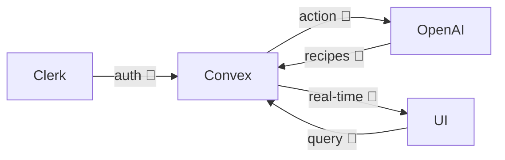

# Pantry Party

A 4-hour build, five months later

<div class="pt-12 opacity-75 text-xl">
  Ryan · Austin · NorfolkJS
</div>

<!--
Welcome. Intros. We'll walk you through a 4-hour full-stack build and what's changed in the tools since.
-->

---
layout: image
image: /photos/placeholder-hero.svg
class: text-white
---

# <span class="bg-black/60 px-4 py-2 rounded">4 hours. One demo. Whatever we could ship.</span>

<!--
CodeTV episode. 4 hours was all we had. Set the mindset before the mechanics.
-->

---
layout: center
---

# CodeTV's rules

- **30 minutes** to plan
- **4 hours** to build
- Ship something **shareable**

<div class="pt-8 text-sm opacity-60">Full-stack challenge episode</div>

<!--
Quick primer on the CodeTV format. Don't dwell — audience gets the shape.
-->

---
layout: two-cols
---

# Pantry Party

Collaborative rooms where people:

- 🥗 Pool pantry ingredients
- 🤖 Generate AI recipes
- 🗳️ Vote on favorites
- ⚡ See updates in real time

::right::


<!--
The concept in one paragraph. If a video clip is ready, swap image src to /video/<file>.mp4 with a <video> tag.
-->

---
layout: quote
---

# "Just use plain websockets."

_— us, that morning_

<v-click>

## "Have you tried Convex?"

_— Jason, 15 minutes in_

</v-click>

<v-click>

We adopted a real-time database neither of us had touched.

</v-click>

<!--
Biggest moment of hour one. The whole architecture swung on this suggestion.
-->

---
layout: center
---

# The stack

<div class="grid grid-cols-3 gap-8 pt-8 text-2xl">
  <div>Astro</div>
  <div>React</div>
  <div>Convex</div>
  <div>Clerk</div>
  <div>OpenAI</div>
  <div>Tailwind</div>
</div>

<!--
Name them fast. Hand off to Austin for the build segment.
-->

---
layout: center
class: bg-black text-white
---

<div class="opacity-60 text-sm">[ B-roll clip placeholder — swap with &lt;video src="/video/codetv-broll.mp4" autoplay muted loop /&gt; when clip is ready ]</div>

<!--
Let the clip play for ~15s. Sets room energy before we start talking shop.
-->

---
---

# What Copilot agent mode nailed

Each of these landed on the first try:

- Astro page + layout scaffolding
- Convex `schema.ts` — rooms, ingredients, recipes, votes
- Clerk setup — middleware, protected routes
- OpenAI recipe-generation action

<v-click>

<div class="pt-8 text-xl opacity-80">
Isolated pieces? Excellent.
</div>

</v-click>

<!--
Don't dunk on Copilot. The scaffolding work genuinely saved us hours.
-->

---
---

# Where it fell apart



The boxes worked. The **wiring** between them is where we bled hours.

<!--
The pivot slide of the build section. Emphasize: scaffolding good, integration hard.
-->

---
---

# Example: auth token didn't flow

Copilot scaffolded Clerk and Convex auth config separately. Wiring them together:

````md magic-move
```ts
// convex/auth.config.ts
export default {
  providers: [
    {
      domain: "clerk-jwt-issuer-hardcoded-here",
      applicationID: "convex",
    },
  ],
};
```

```ts
// convex/auth.config.ts
export default {
  providers: [
    {
      domain: process.env.CLERK_JWT_ISSUER_DOMAIN,
      applicationID: "convex",
    },
  ],
};
```
````

One env var. Twenty minutes of Googling.

<!--
Concrete, representative. Not the only integration bug, but the cleanest to show on stage.
-->

---
---

# The last 30 minutes

- Env vars not propagating to Netlify
- Convex prod deployment ≠ dev deployment
- Clerk JWT issuer URL mismatched between environments
- Recipe generation failing silently on prod

<v-click>

<div class="pt-6 text-xl">What fixed it: a lot of manual copying.</div>

</v-click>

<!--
War stories. Keep it tight and a little funny. Don't wallow.
-->

---
layout: center
class: bg-black text-white
---

<div class="opacity-60 text-sm">[ Final push clip placeholder — swap with &lt;video src="/video/codetv-final-push.mp4" autoplay muted loop /&gt; ]</div>

<!--
Ship-it energy. Transition out of the build segment and into "then vs. now."
-->

---
layout: center
class: text-center
---

# Then → Now

<div class="text-sm opacity-60 mt-8">What changed in five months</div>

<!--
Beat pause. Pivot into the second half of the talk. Ryan takes over (soft lean).
-->

---
layout: two-cols
---

# Then

**Nov 2025**

GitHub Copilot agent mode

- Mix of Anthropic + OpenAI models under the hood
- Best tool available that day
- Great at generating files
- Struggled to cross systems

::right::

# Now

**Apr 2026**

Claude Code

- Daily driver
- Plans, specs, commits, reviews
- Same class of models, better harness

<!--
Don't overstate. Same models, different ergonomics. Set up the next slide.
-->

---
layout: center
---

# The gap that closed

<div class="text-6xl py-8 font-bold">integration</div>

The exact thing that cost us hours during the build  
is the thing that's most different now.

<!--
The thesis slide of the sidebar. Deliver it slowly. Pause after "integration."
-->

---
---

# Evidence: auth hardening

Three artifacts in the `pantry-party` repo, all produced in one session:

- **Spec** — `docs/superpowers/specs/2026-04-20-auth-hardening-design.md`
- **Plan** — `docs/superpowers/plans/2026-04-20-auth-hardening.md`
- **Commits** — `3abd7c5`, `5af3a3c`, `e6ac57f`, ... (small, narrated, reviewable)

````md magic-move
```ts
// src/middleware.ts — before
// (no middleware; /room routes unprotected)
```

```ts
// src/middleware.ts — after
import { clerkMiddleware, createRouteMatcher } from "@clerk/astro/server";

const isProtectedRoute = createRouteMatcher(["/room(.*)", "/create-room"]);

export const onRequest = clerkMiddleware((auth, context, next) => {
  if (isProtectedRoute(context.request) && !auth().userId) {
    return auth().redirectToSignIn();
  }
  return next();
});
```
````

One prompt. Cross-system wiring. PR-ready.

<!--
Point at the artifacts, don't read them. Magic-move makes the before/after obvious.
-->

---
---

# What still hurts / what works

**Still hard**

- Multi-service env var drift (same as before)
- Novel stacks with tiny training footprints
- UI polish judgment calls

**Surprisingly good**

- Following an explicit plan to the letter
- Refactors across 10+ files
- Catching its own mistakes on a re-read

**Day-to-day change**

- Prompt → diff is faster than scaffold → wire
- More time designing, less time plumbing

<!--
Balanced. Don't oversell. This calibrates the audience's trust for the rest of the talk.
-->

---
layout: center
---

<script setup>
import QrcodeVue from 'qrcode.vue'
const roomUrl = 'https://pantryparty.lol/room/XXXX'
</script>

# Try it yourself

<div class="grid grid-cols-2 gap-12 items-center pt-4">
  <div>
    <div class="w-72 mx-auto rounded bg-white p-4 flex items-center justify-center">
      <QrcodeVue :value="roomUrl" :size="256" level="H" />
    </div>
    <div class="text-center pt-4 text-xl font-mono">
      {{ roomUrl.replace('https://', '') }}
    </div>
    <div class="text-center pt-2 text-sm opacity-60">
      Sign up (username / password), join the room, add ingredients.
    </div>
  </div>
  <iframe
    src="https://pantryparty.lol/"
    class="w-full h-96 rounded-lg border border-gray-300"
    sandbox="allow-scripts allow-forms allow-same-origin allow-popups"
  />
</div>

<!--
Read the URL out loud. Give the audience ~30s to scan. Then start driving: add pre-seed ingredients, trigger recipes, vote live. The iframe reflects the live site so they can see real-time updates even before they've signed up.
-->

---
hide: true
---

# Demo backup

<video src="/video/demo-backup.mp4" controls class="w-full max-w-4xl mx-auto" />

<!--
Hidden from normal flow. If the live demo fails, press `o` to open the slide overview, arrow to this slide. 30-second pre-recorded end-to-end run.
-->

---
layout: center
---

# Thanks

<div class="pt-4 text-lg">

**Pantry Party** — [pantryparty.lol](https://pantryparty.lol)
**Source** — github.com/austingalyon/pantry-party
**This deck** — [deck URL — fill in post-deploy]

</div>

<div class="pt-12 text-sm opacity-60">
  Ryan · Austin · NorfolkJS 2026
</div>

<div class="pt-8 text-3xl">Questions?</div>

<!--
Thanks + Q&A. Leave the QR from slide 18 on screen if audience is still signing up.
-->
